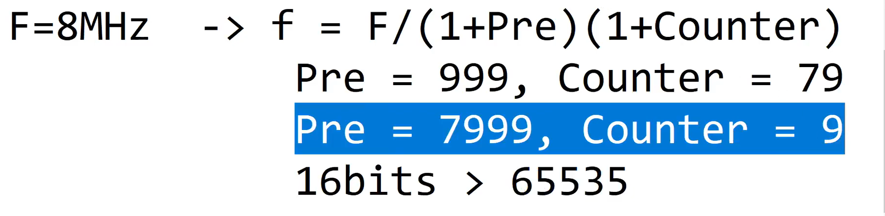

# Template-STM32

## Interrup Timer

1. In file `.ioc`:

   * `timers` -> `TIM2 `,
   * In `Clock Source` choose `Internal Clock`
     `Configuration`:
     * `Paramater Settings`:     set `Prescaler` = 7999 and `Couter Period` = 9
     * `NVIC Setting` : tick into box `Enabled`

```apache

in file main.c:  

HAL_TIM_Base_Start_IT(&htim2);
//......
setTimer1(200);
  while (1)
  {
	  if(timer1_flag == 1){
		  setTimer1(200);
		  //TODO
		  HAL_GPIO_TogglePin(GPIOA, GPIO_PIN_5);
    }
    /* USER CODE END WHILE */

//....................
void HAL_TIM_PeriodElapsedCallback(TIM_HandleTypeDef *htim){
	timerRun();
}

#--------------------------------------------------------------------------------------------------------------------

in file software_timer.h:
#ifndef INC_SOFTWARE_TIMER_H_
#define INC_SOFTWARE_TIMER_H_

extern int timer1_flag;

void setTimer1(int duration);
void timerRun();

#endif /* INC_SOFTWARE_TIMER_H_ */

#--------------------------------------------------------------------------------------------------------------------

in file software_timer.c:
#include "software_timer.h"

int timer1_counter = 0;
int timer1_flag = 0;

void setTimer1(int duration){
	timer1_counter = duration;
	timer1_flag = 0;
}

void timerRun(){
	if(timer1_counter > 0){
		timer1_counter --;
		if(timer1_counter <= 0){
			timer1_flag = 1;
		}
	}
}

```
- Cách tính Prescaler và Couter:
  

